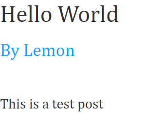

# Part 5: Styling the blog and finalizing.

In this part we're going to style the posts.

Now let's delete the `JS` folder, but let's keep the `CSS` Folder.

Now let's create a `style.css`.

Add this CSS code to style it.

```css
* {
    font-family: Cambria, Cochin, Georgia, Times, 'Times New Roman', serif;
    font-size: 1.2rem;
    color: #333;
    line-height: 1.5;
    margin: 0;
    padding: 0;
    box-sizing: border-box;
}

body {
    background: #ffffff;
}

h1 {
    font-size: 3rem;
    line-height: 1.2;
    margin-bottom: 1rem;
}

h2 {
    font-size: 2rem;
    margin-bottom: 1rem;
}

h3 {
    font-size: 1.5rem;
    margin-bottom: 1rem;
    color: #ffa;
}

p {
    margin-bottom: 1rem;
}
```

now in the `app.py` file let's change the `Root`, to add the CSS file.

```python
Root = Component("HTTP-Blog", stylesheet="public/css/style.css")
```

Now run the app and see the page now.



And that's about it.

A fully functioning app in Lemon 🍋.

Github: https://github.com/Sas2k/HTTP-Blog